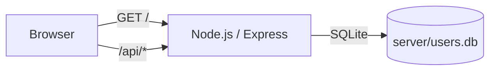
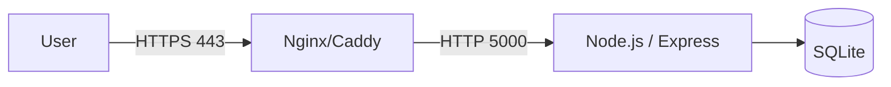

# 网站收藏管理器

一个支持「本地使用 + 登录云端同步」的网站收藏管理工具，提供分类管理、批量导入、搜索与多端同步等能力。

- 前端：React 18、TypeScript、Vite、Tailwind CSS
- 后端：Node.js、Express、SQLite
- 认证与安全：JWT、bcrypt、express-rate-limit、helmet、cors

## 文档目录

- [概述](#概述)
- [功能特性](#功能特性)
- [架构概览](#架构概览)
- [系统要求](#系统要求)
- [安装部署](#安装部署)
- [配置说明](#配置说明)
- [使用指南](#使用指南)
- [验证测试](#验证测试)
- [常见问题](#常见问题)
- [维护信息](#维护信息)

## 概述

本项目支持两种使用方式：

- 游客模式：不登录，数据仅保存在浏览器本地存储
- 登录同步：通过后端 API 进行登录与数据同步，数据持久化在 SQLite（`server/users.db`）

生产环境推荐部署形态为「一个 Node 服务同时提供页面与 API」，即：

- 页面：`/`
- API：`/api/*`

## 功能特性

- 分类管理：自定义分类名称、图标与颜色
- 书签管理：新增/编辑/删除、置顶、收藏、访问计数
- 搜索能力：站内搜索 + 多搜索引擎快捷检索
- 导入导出：支持 HTML 书签文件与 JSON 数据导入
- 登录与云端同步：JWT + SQLite 存储，跨设备同步分类与书签
- 管理员面板：用户列表、创建/编辑/删除用户（管理员权限控制）

## 架构概览

### 运行时组件



### 生产推荐接入（可选反代）



## 系统要求

### 运行环境

- Node.js：18+（建议 LTS）
- npm：随 Node.js 安装
- 操作系统：Windows / Linux / macOS

### 可选组件（生产推荐）

- pm2：守护进程、日志与开机自启
- Docker：容器化部署
- Nginx/Caddy：反向代理与 HTTPS

## 安装部署

本节包含开发环境启动与生产环境部署的完整步骤，所有命令默认在项目根目录执行。

### 目录结构

```
.
├─ public/               # 静态资源
├─ server/               # 后端 API 与数据库逻辑
├─ src/                  # 前端源码
├─ tests/                # 简单测试脚本
├─ docs/                 # 详细文档（部署、API、配置等）
└─ package.json
```

### 开发环境（本地联调）

#### 步骤 1：安装依赖

```bash
npm install
```

预期输出（示例）：

- `added ... packages, and audited ... packages`

成功标准：

- 生成 `node_modules/`
- 命令退出码为 0

#### 步骤 2：启动后端（API）

```bash
npm run server
```

预期输出（示例）：

- `[server] listening on http://localhost:5000`
- `Connected to the SQLite database.`

成功标准：

- `http://localhost:5000/api/health` 返回 `{"ok":true,"ts":...}`

#### 步骤 3：启动前端（Vite 开发服务器）

另开一个终端运行：

```bash
npm run dev
```

预期输出（示例）：

- `Local:   http://localhost:3000/`

成功标准：

- 访问 `http://localhost:3000/` 能正常打开页面

### 生产环境（推荐：Node 同时托管页面与 API）

#### 步骤 1：拉取代码

```bash
git clone <your-repo-url>
cd <project-root>
```

成功标准：

- 项目文件下载完整，根目录包含 `package.json`、`server/`、`src/`

#### 步骤 2：安装依赖（建议使用锁文件）

```bash
npm ci
```

注意事项：

- `npm ci` 会严格按 `package-lock.json` 安装，适合生产环境的可复现构建

成功标准：

- 命令退出码为 0

#### 步骤 3：构建前端产物

```bash
npm run build
```

预期输出（示例）：

- `vite ... building for production...`
- `dist/client/index.html ...`

成功标准：

- 存在目录 `dist/client/`
- `dist/client/index.html` 存在

#### 步骤 4：配置环境变量（生产必配）

生产环境必须设置以下环境变量，否则服务会拒绝启动：

- `JWT_SECRET`：JWT 签名密钥（建议使用强随机值，长度 ≥ 32）
- `DEFAULT_ADMIN_PASSWORD`：首次初始化管理员密码（建议强密码，长度 ≥ 12）

可选：

- `PORT`：服务监听端口（默认 `5000`）
- `NODE_ENV`：建议设置为 `production`
- `DEFAULT_ADMIN_USERNAME`：默认 `admin`
- `DEFAULT_ADMIN_EMAIL`：默认 `admin@example.com`

Linux/macOS 示例：

```bash
export NODE_ENV=production
export PORT=5000
export JWT_SECRET="change-me-in-production"
export DEFAULT_ADMIN_PASSWORD="change-me-in-production"
```

Windows PowerShell 示例：

```powershell
$env:NODE_ENV="production"
$env:PORT="5000"
$env:JWT_SECRET="change-me-in-production"
$env:DEFAULT_ADMIN_PASSWORD="change-me-in-production"
```

成功标准：

- 启动服务时不会出现 `Missing required env: JWT_SECRET` 或 `Missing required env: DEFAULT_ADMIN_PASSWORD`

#### 步骤 5：启动服务

前台启动（适合验证环境）：

```bash
npm run server
```

预期输出（示例）：

- `[server] listening on http://localhost:5000`
- `Connected to the SQLite database.`

成功标准：

- 页面：`http://<host>:<port>/` 可访问
- 健康检查：`http://<host>:<port>/api/health` 返回 `{"ok":true,"ts":...}`

#### 步骤 6：后台守护（pm2，推荐）

安装 pm2：

```bash
npm i -g pm2
```

启动：

```bash
pm2 start server/index.js --name bookmark-manager
```

查看状态与日志：

```bash
pm2 status
pm2 logs bookmark-manager
```

开机自启（按 pm2 输出提示执行）：

```bash
pm2 startup
pm2 save
```

成功标准：

- `pm2 status` 中 `bookmark-manager` 为 `online`
- 访问 `http://<host>:<port>/api/health` 正常返回

### 生产环境（可选：Docker）

#### 步骤 1：构建镜像

```bash
docker build -t bookmark-manager .
```

成功标准：

- `docker images` 能看到 `bookmark-manager`

#### 步骤 2：运行容器（建议持久化数据库）

Linux/macOS（将数据库挂载到宿主机当前目录）：

```bash
docker run -d \
  --restart unless-stopped \
  -p 5000:5000 \
  -e NODE_ENV=production \
  -e PORT=5000 \
  -e JWT_SECRET="change-me-in-production" \
  -e DEFAULT_ADMIN_PASSWORD="change-me-in-production" \
  -v "$(pwd)/server/users.db:/app/server/users.db" \
  --name bookmark-manager \
  bookmark-manager
```

Windows PowerShell：

```powershell
docker run -d `
  --restart unless-stopped `
  -p 5000:5000 `
  -e NODE_ENV=production `
  -e PORT=5000 `
  -e JWT_SECRET="change-me-in-production" `
  -e DEFAULT_ADMIN_PASSWORD="change-me-in-production" `
  -v "${PWD}\server\users.db:/app/server/users.db" `
  --name bookmark-manager `
  bookmark-manager
```

成功标准：

- `docker ps` 中容器状态为 `Up`
- `http://<host>:5000/api/health` 返回 `{"ok":true,"ts":...}`

### HTTPS 与反向代理（推荐）

生产环境通常使用 Nginx/Caddy 将公网 HTTPS 反代到本服务（例如 `http://127.0.0.1:5000`）。

注意事项：

- 本项目由同一个 Node 服务同时提供页面与 API，因此只需要反代一个上游端口即可（`/` 与 `/api/*` 都会正常工作）
- 生产环境建议将 CORS `origin` 收敛为固定域名来源（目前后端为 `origin: '*'`，见 `server/index.js:28`）

### 前后端分离部署（可选）

默认生产构建走同域请求（前端请求 `/api/*`），适合用本项目的 Node 服务托管页面与 API。

如果你把前端静态资源部署到 CDN/静态站点、后端 API 单独域名，可在构建前设置：

```bash
VITE_API_BASE_URL="https://api.example.com" npm run build
```

说明：

- 未设置 `VITE_API_BASE_URL` 时：生产环境默认使用同域 `/api/*`；开发环境默认使用 `http://localhost:5000`

### Cloudflare 部署（脚本入口）

项目提供 `npm run deploy`（wrangler）作为部署脚本入口，但仓库默认未包含 `wrangler.toml`，如需部署到 Cloudflare 请自行补充对应配置。

## 配置说明

### 环境变量清单

| 变量名 | 默认值 | 作用 | 生产建议 |
|---|---:|---|---|
| `PORT` | `5000` | 服务监听端口 | 按需修改 |
| `NODE_ENV` | 未强制 | 运行环境标识 | 设为 `production` |
| `JWT_SECRET` | 内置默认值 | JWT 签名密钥 | 必配，强随机值 |
| `DEFAULT_ADMIN_USERNAME` | `admin` | 初始管理员用户名 | 按需修改 |
| `DEFAULT_ADMIN_EMAIL` | `admin@example.com` | 初始管理员邮箱 | 按需修改 |
| `DEFAULT_ADMIN_PASSWORD` | `admin123` | 初始管理员密码 | 必配，强密码 |
| `VITE_API_BASE_URL` | 无 | 前端 API 基址（仅构建时使用） | 前后端分离时设置 |

数据存储：

- SQLite 数据库文件：`server/users.db`
- 建议：生产环境将该文件纳入备份；Docker 场景建议做卷挂载

限流策略（默认值）：

- 登录接口 `POST /api/auth/login`：每 IP 15 分钟最多 10 次
- 其余 `/api/*`：每 IP 15 分钟最多 5000 次

### 配置模板示例

Linux/macOS：

```bash
export NODE_ENV=production
export PORT=5000
export JWT_SECRET="replace-with-a-strong-random-secret"
export DEFAULT_ADMIN_USERNAME="admin"
export DEFAULT_ADMIN_EMAIL="admin@example.com"
export DEFAULT_ADMIN_PASSWORD="replace-with-a-strong-password"
```

Windows PowerShell：

```powershell
$env:NODE_ENV="production"
$env:PORT="5000"
$env:JWT_SECRET="replace-with-a-strong-random-secret"
$env:DEFAULT_ADMIN_USERNAME="admin"
$env:DEFAULT_ADMIN_EMAIL="admin@example.com"
$env:DEFAULT_ADMIN_PASSWORD="replace-with-a-strong-password"
```

更多说明：

- 配置说明：`docs/configuration.md`
- API 文档：`docs/api.md`
- 部署手册（更细节）：`docs/deployment.md`

## 使用指南

### 首次启动与管理员账号

启动后端时会自动初始化数据库表，并在不存在管理员账号时创建初始管理员（见 `server/db.js` 的初始化逻辑）。

默认管理员信息：

- 用户名：`DEFAULT_ADMIN_USERNAME`（默认 `admin`）
- 邮箱：`DEFAULT_ADMIN_EMAIL`（默认 `admin@example.com`）
- 密码：`DEFAULT_ADMIN_PASSWORD`（生产环境必须显式设置）

### 登录与同步

- 登录：页面中输入「用户名或邮箱 + 密码」登录
- 同步：登录后会拉取 `/api/user/data` 并在后续操作中进行增量同步

### 管理员面板

管理员用户登录后，可访问管理员页面进行用户管理（依赖 `role === "admin"` 权限）。

## 验证测试

本节提供部署完成后的验证方法、测试用例与预期结果，用于确认系统可用。

### 1) 健康检查（必须通过）

浏览器访问：

- `http://<host>:<port>/api/health`

预期结果：

```json
{ "ok": true, "ts": 1730000000000 }
```

成功标准：

- HTTP 200
- `ok === true`

命令行示例（Windows PowerShell）：

```powershell
Invoke-RestMethod http://localhost:5000/api/health | ConvertTo-Json -Compress
```

### 2) 页面静态资源检查

访问 `http://<host>:<port>/`，预期：

- 能加载页面
- 浏览器控制台无持续报错

如果看到 `Client build not found`，说明没有执行 `npm run build` 或 `dist/client` 不存在。

### 3) Auth API 测试脚本（推荐）

项目提供简单测试脚本 `tests/auth.test.js`：

```bash
node tests/auth.test.js
```

预期输出（示例）：

- `Starting Auth Tests...`
- `✅ Register Success: ...`
- `✅ Login Success. Token received.`
- `✅ Protected Route Success: ...`
- `All Tests Passed!`

成功标准：

- 脚本退出码为 0

### 4) 关键业务 API 用例（可选抽查）

- 登录：`POST /api/auth/login`，成功返回 `token`
- 拉取数据：`GET /api/user/data`，成功返回 `categories` 与 `bookmarks` 数组
- 新增分类：`POST /api/categories`，返回 `{ "success": true }`
- 新增书签：`POST /api/bookmarks`，返回 `{ "success": true }`

API 详情与示例请求见：`docs/api.md`

## 常见问题

### 1) 页面显示 “Client build not found”

原因：未构建前端或 `dist/client` 不存在。

处理：

```bash
npm run build
npm run server
```

### 2) 生产启动报错缺少环境变量

现象：

- `Missing required env: JWT_SECRET`
- `Missing required env: DEFAULT_ADMIN_PASSWORD`

处理：按「安装部署 → 生产环境 → 配置环境变量」设置后再启动。

### 3) 端口被占用

处理：

- 通过 `PORT` 更换端口，例如：`PORT=8080 npm run server`

### 4) 登录/同步提示 “Too many requests”

原因：触发限流。

处理：

- 降低并发导入/同步频率
- 检查是否存在循环请求

### 5) 数据库权限问题

确保运行用户对 `server/users.db` 拥有读写权限；Docker 场景注意挂载文件的宿主机权限。

## 维护信息

### 项目版本

- 当前版本：`0.0.1`（见 `package.json`）

### 文档更新记录

| 日期 | 变更 |
|---|---|
| 2025-12-21 | 完整补齐部署、配置、验证与维护章节 |

### 问题反馈

- 建议优先通过仓库的 Issues 提交问题与建议
- 也可参考贡献指南：`CONTRIBUTING.md`

### 文档最后更新时间

- 2025-12-21

## 许可证

本项目采用 MIT License，详见 `LICENSE`。
